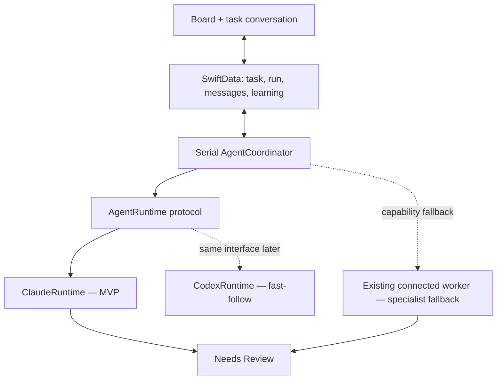
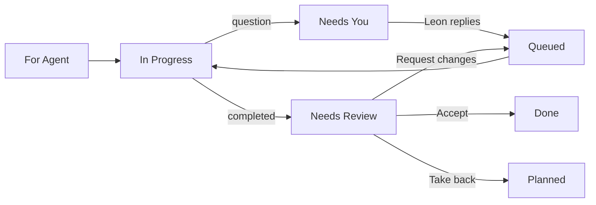

# Agent task sessions — design spec

- **Date:** 2026-07-13
- **Status:** Approved in conversation; awaiting written-spec review
- **Builds on:** ADR-0010, the shared task board, the agent file bridge, and the
  `drain-agent-queue` connected worker
- **Supersedes for the default path:** the manually invoked worker as the normal
  way an agent-owned task gets picked up

## Summary

Mustard will automatically pick up delegated tasks, run them through a persistent
Claude CLI session when needed, and keep the task's questions, replies, results,
artifacts, reviews, and learning in one durable conversation.

The MVP runs one agent turn at a time. A task waiting for Leon releases the runner,
so the next queued task can proceed. Every completed task lands in **Needs Review**.
Shortcut and Jira creation are allowed but reviewed afterward; email is draft-only
and sending is unavailable. The existing file bridge remains as a specialist fallback
for work that cannot run in the default CLI environment.

Mustard learns from review outcomes, but it does not silently change global behaviour.
Reusable learning is proposed, scoped, approved, versioned, and reversible.

## Problem

Mustard already has most of a delegated-work pipeline:

- The board represents agent ownership and stages.
- `AgentService` exports `forAgent` and `queued` tasks as file work orders.
- A connected `drain-agent-queue` skill can perform the work and return results.
- Imported results move tasks into `needsApproval` or `needsReview`.

The current process is not yet an agent that reliably picks up work:

- Nothing consumes the outbox automatically; Leon must invoke the connected worker.
- Export and result ingestion are throttled to roughly ten minutes.
- Questions cannot return as a first-class task state and conversation.
- The worker's session identity is not attached durably to a Mustard task.
- Review feedback improves a single attempt but does not become approved reusable
  knowledge.
- The repository guidance still documents parts of the retired `OutputCard` flow.

The MVP goal is not a hosted multi-agent platform. It is a dependable, local-first
loop in which assigning a task to the agent is enough to make work begin.

## Product principles

1. **One task, one conversation identity.** Simple tasks can finish in one turn;
   complex tasks can pause, ask questions, resume, and be revised without losing context.
2. **Waiting never blocks the queue.** One active CLI turn at a time does not mean
   one unfinished task at a time.
3. **Best-effort by default.** A missing specialist skill is not a reason to decline.
4. **Skills encode procedures, not basic capability.** Use them for repeatable,
   convention-heavy, or risky work; use the general agent for ordinary tasks.
5. **Review is universal.** Every completed delegated task moves to **Needs Review**.
6. **Autonomy inside, safety at the edge.** Reversible work and reviewable artifacts
   may be created automatically. Prohibited consequential actions remain unavailable.
7. **Learning is evidence-backed and approved.** No silent self-modification.

The useful inspiration from Bond is the orchestration layer: gather cross-tool context,
filter noise, retain commitments, delegate routine work, and keep chat attached to the
work rather than acting as an isolated chatbot. References:
[Product Hunt overview](https://www.producthunt.com/products/bond-12) and
[Bond product site](https://www.bondapp.io/).

## Chosen architecture

Mustard owns the durable task, transcript, queue, review state, and learning. The CLI
provider owns model context during an individual task session.



### Why this approach

It gives Mustard the product experience Leon wants—automatic pickup and normal task
chat—while preserving local-first subscription execution. It reuses the existing
`Process` runner, board, routing, trust, and bridge code. A hosted service would add
auth, infrastructure, and metered execution before the local loop is proven. Expanding
only the file bridge would leave the conversation delayed and split across two sources
of truth.

## Board lifecycle

Add `TaskStage.needsInput`, displayed as **Needs You**. Do not reuse `blocked`:
`blocked` means the work has an ordinary dependency or blocker; `needsInput` means an
agent session is specifically waiting for Leon's reply.



Stage meanings:

| Stage | Meaning in the new loop |
|---|---|
| `forAgent` | Delegated and waiting for first pickup |
| `needsApproval` | Preserved for prepared/proposed task gates and connected-bridge prep compatibility; not used for ordinary explicit delegation |
| `queued` | Authorized and ready to start or resume |
| `inProgress` | Currently owns the single runner slot |
| `needsInput` | Session is paused for a human answer; owns no runner slot |
| `needsReview` | Agent turn completed; output and artifacts await Leon |
| `done` | Leon accepted the result |

Explicit delegation is authorization for the MVP's allowed work. It does not require a
second prep/approval pass. Agent-console recommendations remain pending `Recommendation`
records until approved; approval creates or promotes queued work exactly as it does today.

Every `needsReview` task appears in both the Board's **Needs Review** column and a unified
Review queue in the Agent surface. These are two views of the same stage, not duplicate
records. The Agent badge/notch waiting count includes `needsInput` and `needsReview`.

## Durable data model

All additions follow the existing CloudKit-shaped rules: fields have defaults, optional
relationships are used where required, and there are no uniqueness constraints.

### `AgentRun`

One current durable conversation record per delegated `MustardTask`:

- `uid`
- optional task relationship
- provider (`claude` in MVP; `codex` reserved)
- optional provider session ID, allocated on first pickup
- state (`queued`, `running`, `needsInput`, `completed`, `failed`, `cancelled`,
  `interrupted`)
- attempt and resume counts
- working directory and resolved project/area
- timestamps for creation, start, last activity, and completion
- last structured outcome and last error
- whether a connected-worker fallback is required

Taking a task back preserves its `AgentRun` and transcript. Redelegating the same task
continues the conversation identity but may start a replacement provider session when
the previous one is no longer resumable.

### `AgentMessage`

An ordered task timeline independent of the provider's private session files:

- role (`human`, `agent`, `system`)
- kind (`delegation`, `question`, `answer`, `progress`, `result`, `reviewFeedback`,
  `recovery`, `error`)
- content
- created timestamp and stable sequence number
- optional artifact/link payload
- optional provider turn ID

The first MVP need not stream tokens. It shows a working indicator while the CLI runs,
then persists the structured turn. Token/event streaming is a fast-follow behind the
same model.

### `LearningProposal` and `AgentMemory`

`LearningProposal` stores a candidate improvement, its supporting task/review evidence,
suggested scope, destination (`memory` or `skillChange`), confidence, status, and proposed
diff when applicable.

An approved preference becomes `AgentMemory`, with:

- concise instruction text
- scope (`taskType`, `skill`, `project`, or `global`)
- scope key
- evidence references
- enabled flag
- version and timestamps

Skill changes remain file-backed. Approval applies a visible diff, preserves the prior
revision for undo, and never commits or pushes automatically.

## Coordinator and runtime boundary

`AgentCoordinator` is an observable orchestration service separate from view code. Its
decisions are delegated to pure logic units so scheduling and transitions are testable.

The MVP scheduler:

1. Does nothing while a run is active or the runtime is globally paused.
2. Selects the oldest/highest-priority runnable `forAgent` or `queued` task.
3. Resolves its project working directory and relevant approved learning.
4. Persists `inProgress` and a system timeline event before launching the process.
5. Starts or resumes the provider session.
6. Applies exactly one structured outcome.
7. Releases the slot and selects the next runnable task.

`AgentRuntime` is provider-neutral:

```text
start(request)  -> AgentTurnResult
resume(sessionID, request) -> AgentTurnResult
cancel(activeTurn)
health() -> available | authenticationRequired | unavailable
```

`ClaudeRuntime` ships first because Mustard already has a tested Claude process runner,
subscription authentication, Claude-oriented project guidance, and connected skills.
Mustard chooses and persists the session UUID, runs Claude non-interactively, closes
stdin, preserves the existing environment-scrubbing guarantees, and requires a JSON
schema for the final turn.

`CodexRuntime` is a fast-follow using the same contract. The installed Codex CLI supports
non-interactive persisted sessions plus `codex exec resume`, so no data-model change is
required when it is added.

## Structured turn contract

Every default-runtime turn returns one of:

- `completed`: assistant message, concise summary, artifacts/links, verification notes,
  and optional learning candidates.
- `needs_input`: assistant message and one or more focused questions.
- `failed`: assistant message, error category, retry disposition, and any partial output.
- `cancelled`: acknowledgement that the active work stopped.
- `requires_connected_worker`: capability and reason for specialist fallback.

The coordinator—not the model—owns stage changes. Unknown or malformed outcomes are
failures and never imply completion.

When Leon replies in **Needs You**, Mustard appends an `answer` message and changes the
task to `queued`. The next turn resumes the same provider session. If resume fails because
the session is missing or corrupt, Mustard starts a replacement session with a compact
reconstruction from the durable task transcript, records a `recovery` event, and continues.

## Instruction layers

Do not create a second large provider-specific repository guide. Use three layers:

1. **Mustard worker contract.** A provider-neutral markdown resource, proposed path
   `Sources/MustardKit/Agent/Prompts/MustardAgentContract.md`, injected into every first
   turn and reiterated compactly on resume. It defines task scope, safety, allowed
   outcomes, review requirements, and the structured response contract.
2. **Project instructions.** The runtime works in the routed project directory, allowing
   Claude to load `CLAUDE.md` and a future Codex runtime to load `AGENTS.md` normally.
3. **Skills and approved learning.** The request names relevant available skills and
   injects only approved memories matching the current task, skill, project, and global
   fallback scopes.

The worker contract requires the agent to:

- Work only on the assigned task.
- Endeavour to complete it; a missing skill is not a reason to decline.
- Use and follow a matching skill when one materially applies.
- Ask focused questions instead of fabricating missing scope.
- Verify artifacts before reporting completion.
- Obey the action policy below.
- Return every result through the structured turn contract.
- Suggest reusable learning but never modify shared behaviour silently.

The existing repository `CLAUDE.md` remains an engineering guide. Implementation must
update its stale `OutputCard` and manual-worker descriptions after the new loop ships.
No new `AGENTS.md` is required for the Claude-first MVP; the Codex adapter uses one when
present.

## Skills policy

The general agent may attempt any delegated task. Skills are required only when a matching
skill defines a specialised procedure or safety boundary. High-value initial skills are
release preparation, Shortcut/Jira creation, email drafting, and project-specific routines.

Skill discovery happens at runtime in the routed project/vault. The worker reads the
matching `SKILL.md` directly. It does not refuse work merely because no skill matches.

## Action and review policy

| Action | MVP behaviour |
|---|---|
| Research, analysis, local files, code, vault notes | Allowed; result goes to review |
| Create Shortcut story | Allowed; verify and return link to review |
| Create Jira issue/link | Allowed; verify and return link to review |
| Create email draft | Allowed; return draft/link to review |
| Send email | Unavailable |
| Post Slack/Teams message | Unavailable; draft only when supported |
| Delete external data, purchase, publish, or other irreversible action | Unavailable |

Review is mandatory regardless of trust level in the MVP. Trust can later reduce review
friction using observed acceptance history, but automatic acceptance is not part of this
spec.

## Connected-worker fallback

The existing `_agent/outbox` / `_agent/results` bridge remains supported for a task whose
default runtime returns `requires_connected_worker`. The task releases the normal runner
slot and clearly displays **Connected worker required**.

For the MVP, Leon may launch the existing connected worker from that task. Its result is
normalized into the same `AgentMessage` timeline and `needsReview` stage. The old bridge's
`prep` mode is compatibility-only; ordinary explicit delegation no longer requires it.

Automatically launching or remotely controlling a fully connected interactive session is
a fast-follow. A fallback task waiting for that environment never blocks ordinary tasks.

## Learning loop

Each review records:

- accepted, revised, rejected, or taken-back outcome
- written review feedback
- difference between proposed and accepted content where available
- provider, project, action type, and skill used
- first-pass success or revision count

Feedback is immediately available within the same task session. Reusable learning is
eligible for a proposal when Leon explicitly says to remember it or the same comparable
correction appears at least twice in the same scope. The agent may also nominate a
candidate, but nomination never applies it.

Approved learning uses the narrowest useful scope:

1. task type or skill
2. project/area
3. global only for genuinely universal preferences

Mustard retrieves compact relevant memories; it does not paste whole historical
transcripts into new prompts. Memories can be inspected, edited, disabled, or deleted.
Skill updates require diff approval and are reversible.

## Failures, recovery, and idempotency

- **Needs input:** persist the question, move to `needsInput`, and continue the queue.
- **Authentication expired:** pause the runtime globally and show one login banner;
  queued tasks remain queued.
- **Rate limit/transient failure:** bounded backoff. Do not fail every queued task against
  the same unhealthy runtime.
- **Timeout:** cancel the process, preserve partial diagnostics, and apply retry policy.
- **App termination during a turn:** mark the run `interrupted`. On relaunch, reconcile
  before retrying.
- **Session resume failure:** reconstruct a replacement from the durable transcript.
- **Take Back/cancel:** terminate the active process if present, preserve history, and
  return the task to `planned`.
- **Malformed output:** record failure; never infer success from prose.

Retries distinguish safe local work from external duplication risk. Shortcut/Jira work
uses the stable Mustard task UID as an idempotency key in the request and searches for an
existing artifact before creation. If Mustard cannot establish whether an external write
succeeded, it moves the task to **Needs Review** with **Completion uncertain** instead of
blindly retrying.

## UI changes

### Board

- Add the **Needs You** stage/column to the agent/everyone views.
- Show working, waiting, and review badges from the explicit task/run state.
- Keep the existing **Needs Review** column as the canonical review stage.

### Task detail

- Add the chronological conversation below task context.
- In `needsInput`, pin the agent question and a reply composer.
- In `needsReview`, show summary, verification, artifacts/links, transcript, and actions:
  **Accept**, **Request changes**, and **Take back**.
- **Request changes** accepts feedback, appends it to the conversation, and requeues the
  same session.
- Display recovery, retry, and uncertain-completion events plainly.

### Agent surface and ambient UI

- Add a unified Review queue backed by `TaskStage.needsReview`.
- Surface Needs You and Needs Review counts in the Agent badge/notch waiting count.
- Show runtime health and a single authentication-required banner.
- Show proposed learning in a reviewable queue with approve/edit/reject and undo for
  applied changes.

## Testing

New decision logic is pure and TDD'd per repository rules:

- runnable-task selection and serial scheduling
- full task/run transition matrix
- Needs You releasing the runner
- retry and external duplicate-risk policy
- capability routing and bridge fallback
- learning proposal eligibility, relevance, and scope
- review actions and learning evidence

Runtime integration tests use stub executables to cover:

- new session creation and provider-session persistence
- resume after a human answer and after review feedback
- every structured outcome
- authentication, rate limit, timeout, cancellation, and malformed output
- concurrent stdout/stderr draining
- app-relaunch interruption recovery
- missing-session reconstruction

SwiftData integration tests cover relationships, message ordering, persistence, and
launch reconciliation. Existing bridge tests remain and gain normalization coverage into
the new run/message model.

Required final commands:

```bash
swift test
swift build
```

Views are build-verified and visually confirmed by Leon; no claim that they look right is
made from the agent session.

## MVP acceptance scenarios

1. A simple delegated task is picked up automatically and lands in Needs Review.
2. “Prep release” asks a question, releases the queue, and resumes after Leon answers.
3. A second task completes while “Prep release” waits.
4. Shortcut/Jira creation returns a working link and does not duplicate on retry.
5. An email task creates a draft and has no send path.
6. Request changes resumes the original task conversation.
7. Review feedback produces a scoped learning proposal; approving it affects the next
   relevant task.
8. Closing and reopening Mustard loses neither queued work nor conversations.

## Delivery slices

1. **Durable conversation foundation:** new stage/models, pure transitions, task timeline.
2. **Claude runtime and serial coordinator:** start/resume/cancel, structured outcomes,
   automatic pickup, runtime health.
3. **Questions and review:** Needs You, reply/resume, unified Review queue, revision loop.
4. **Safety and recovery:** interruption reconciliation, bounded retry, idempotency,
   connected-worker normalization.
5. **Approved learning:** evidence, proposals, scoped memories, skill diff/undo.
6. **Fast-follows:** Codex runtime, limited parallelism, live event streaming, automatic
   connected-session launch, and earned review reduction.

## Explicitly out of scope

- More than one active agent turn at a time.
- Hosted execution or Mac-independent workers.
- Automatic email sending, message posting, purchasing, publishing, or deletion.
- Automatic application of global memories or skill changes.
- Automatic acceptance of completed tasks.
- Live token streaming in the initial MVP.
- Creating a skill for every possible task.
- Replacing SwiftData with the provider's private session store.
